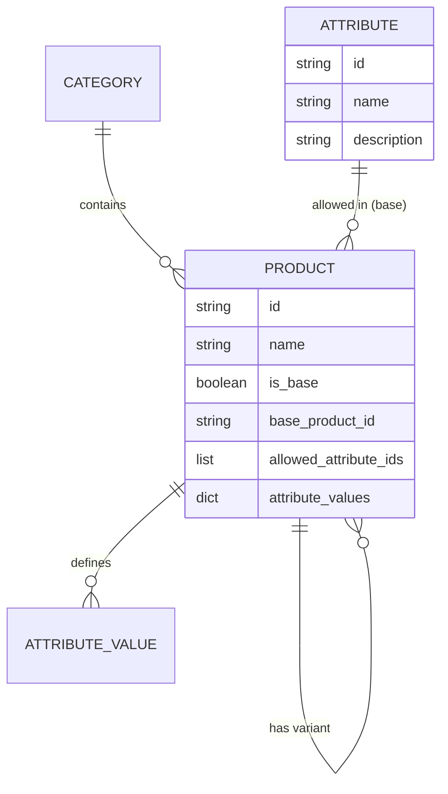

# Product Attributes and Variants System

This document describes the design and implementation of the generic product attribute system in PriceHive.

## 1. Data Model

The system uses a flexible model to represent products, base products, and variants.

### Attributes
Generic attributes that can be associated with products.
- `id`: UUID
- `name`: String (e.g., "Sabor", "Grasa")
- `description`: String (Optional)

### Product Model Updates
The `Product` collection now supports hierarchical relationships and dynamic attributes.

- `is_base`: Boolean. If true, this product serves as a conceptual base for variants.
- `allowed_attribute_ids`: List of Attribute UUIDs. Defines which attributes are applicable to variants of this base product.
- `base_product_id`: UUID (Optional). References the base product if this is a variant.
- `attribute_values`: Dictionary `{attribute_id: value_string}`. Stores the specific values for this variant.

## 2. Entity Diagram (Conceptual)



## 3. Data Structure Examples

### Base Product: Yogurt
```json
{
  "id": "base-yogurt-uuid",
  "name": "Yogur",
  "category_id": "category-dairy-uuid",
  "is_base": true,
  "allowed_attribute_ids": ["attr-flavor-uuid", "attr-fat-uuid"],
  "base_product_id": null,
  "attribute_values": {}
}
```

### Variant: Strawberry Yogurt
```json
{
  "id": "variant-strawberry-uuid",
  "name": "Yogur de Fresa",
  "category_id": "category-dairy-uuid",
  "is_base": false,
  "base_product_id": "base-yogurt-uuid",
  "attribute_values": {
    "attr-flavor-uuid": "Fresa",
    "attr-fat-uuid": "Entera"
  }
}
```

## 4. Backend Implementation
- **Flexibility**: Using a Dictionary for `attribute_values` allows adding new attributes without MongoDB schema migrations.
- **Validation**: Variants inherit the category from their base product concept, though they can be overridden.
- **Search**: The `get_products` endpoint automatically resolves `base_product_name` for variants to facilitate UI display.

## 5. UI/UX Design
- **Management**: A new "Atributos" tab in the Admin Panel allows creating generic attributes.
- **Product Creation**:
    - Users can toggle "¿Es un Producto Base?".
    - For Base Products, a list of checkboxes allows selecting which attributes variants can have.
    - For regular products, a "Producto Base" dropdown allows linking it as a variant.
    - When a base is selected, dynamic input fields appear for each allowed attribute.
- **Visual Feedback**: Variants display their attribute values as badges in the product table.
