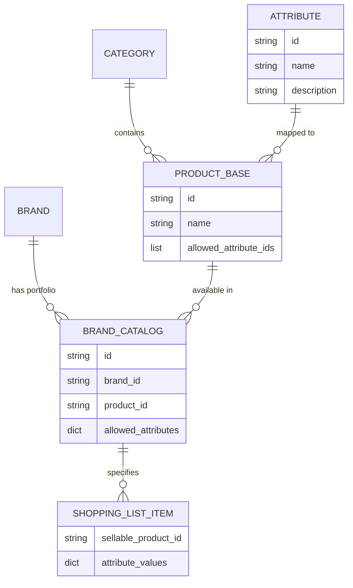

# Product Attributes and Variants System

This document describes the design and implementation of the generic product attribute system in PriceHive.

## 1. Data Model

The system uses a flexible model to represent products, base products, and variants.

### Attributes
Generic attributes that can be associated with products.
- `id`: UUID
- `name`: String (e.g., "Sabor", "Grasa")
- `description`: String (Optional)
- `values`: List of Strings. Predefined options for variants (e.g., ["Fresa", "Limón", "Natural"]).

### Product Model Updates
The `Product` collection now focuses on conceptual base products.

- `is_base`: Boolean. Defaults to true. These products represent general concepts (e.g., "Yogurt").
- `allowed_attribute_ids`: List of Attribute UUIDs. Defines which generic attributes (e.g., "Flavor") are applicable to this concept.

### Brand Product Catalog (Grouped Variants)
Instead of creating a separate `Product` record for every variation, PriceHive uses a grouped matrix model within the `brand_product_catalog` collection.

- `brand_id`: UUID.
- `product_id`: UUID (references a base product).
- `status`: String ("active", "planned", "discontinued").
- `allowed_attributes`: Dictionary `{attribute_id: [value1, value2]}`. Stores the matrix of all valid values this brand offers for this product.

### Shopping List Items (Specific Variants)
Specific variant selections are stored at the shopping list level.

- `sellable_product_id`: UUID (links to the Brand-Product availability).
- `attribute_values`: Dictionary `{attribute_id: selected_value}`. Stores the user's specific choice (e.g., `{flavor: "Lemon"}`).

## 2. Entity Diagram (Grouped Matrix Model)



## 3. Data Structure Examples

### Base Product: Yogurt
```json
{
  "id": "base-yogurt-uuid",
  "name": "Yogur",
  "category_id": "category-dairy-uuid",
  "allowed_attribute_ids": ["attr-flavor-uuid"]
}
```

### Brand Catalog Entry (Grouped)
```json
{
  "brand_id": "brand-danone-uuid",
  "product_id": "base-yogurt-uuid",
  "status": "active",
  "allowed_attributes": {
    "attr-flavor-uuid": ["Fresa", "Limón", "Natural"]
  }
}
```

### Shopping List Item (Specific Choice)
```json
{
  "sellable_product_id": "danone-yogurt-at-mercadona-uuid",
  "product_name": "Yogur",
  "brand_name": "Danone",
  "attribute_values": {
    "attr-flavor-uuid": "Limón"
  }
}
```

## 4. Backend Implementation
- **Data Inheritance**: The public API automatically resolves Brand and Category metadata for items by following the linkage from `SellableProduct` -> `ProductBase`.
- **Estimation Engine**: Price estimation prioritizes records with matching `attribute_values` to provide variant-accurate pricing.
- **Cascading Cleanup**: Deleting a Brand from a Supermarket automatically removes all its associated `SellableProduct` and `SellableProductUnit` links.

## 5. UI/UX Design
- **Inline Catalog Matrix**: The Brand Catalog uses a matrix view where admins multi-select values (Strawberry, Lemon, etc.) directly on the product card. Selections are synced in real-time.
- **Dynamic Selectors**: The Shopping List "Add Item" dialog generates dynamic dropdowns based on the selected brand's portfolio. Selecting "Yogurt" + "Danone" will show a flavor selector with "Fresa, Limón, Natural".
- **Visual Metadata**: Variants are displayed with their selected attributes in parentheses (e.g., "Yogur (Limón)") to distinguish them without requiring unique product names.
